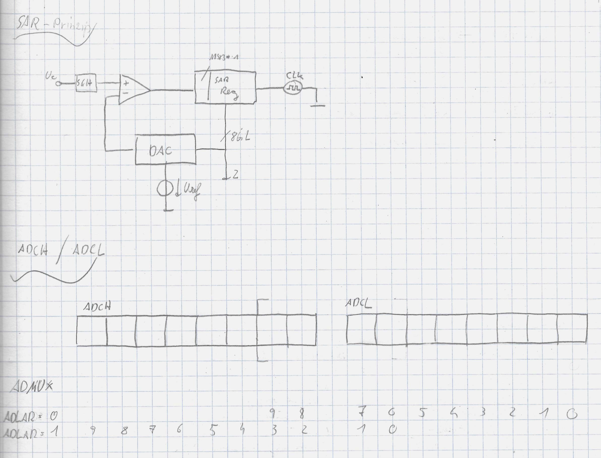

# ADC1

### Code

```c
#include <avr/io.h>
#include <time.h>
#include <avr/interrupt.h>
#define F_CPU 16000000

ISR(ADC_vect) {
	PORTB=ADCL;
	PORTD=ADCH;
}
void initADC() {
	ADCSRA |=(1<<ADEN);					//ADC enablen
	ADCSRA |=(1<<ADPS2) | (1<<ADPS1);	//Prescaler 64
	ADCSRA |=(1<<ADIE);					//Interrupt Enable
	ADCSRA |=(1<<ADATE);				//Auto Trigger Enable
	ADMUX |=(1<<ADLAR);					//left align result (for 8bit)
}
int main(void) {
	initADC();
	DDRB=0xFF;	//Ausgabe
	DDRD=0xFF;	//Ausgabe
	DDRA=0X00;	//Eingabe
	sei();
	ADCSRA|=(1<<ADSC); //starts ADC
  while(1){}
}
```


### Code 2

```c
#include <avr/io.h>
#include <avr/interrupt.h>
#include <avr/delay.h>

void adc_init(){
	ADCSRA |= (1<<ADEN);
	ADMUX = 0x00;
	ADMUX |= (1<<REFS0);
}

int main(void){
	adc_init();
	DDRA = 0x00;
	DDRC = 0xFF;
	DDRD = 0XFF;
	ADCSRA |= (1<<ADSC);
  while(1){
		ADCSRA |= (1<<ADSC);	//start ADC
		while (ADSC == 1){		//wait for result
      PORTC = ADCL;
      PORTD = ADCH;
      _delay_ms(250);
    }
}


```




