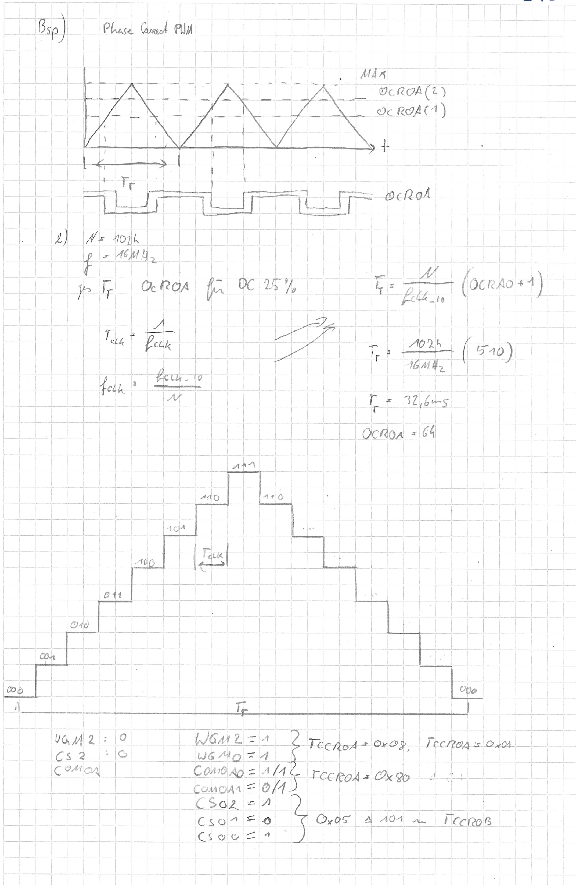

# Phasecorrect Fade

## Eigenschaften




## Code

```c
#include <avr/io.h>
#define F_CPU 16000000
#include <avr/interrupt.h>
#include <util/delay.h>

const uint16_t pwmtable_8D[32] = {
 0, 1, 2, 2, 2, 3, 3, 4, 5, 6, 7, 8, 10, 11, 13, 16, 19, 23,
 27, 32, 38, 45, 54, 64, 76, 91, 108, 128, 152, 181, 215, 255
};

void initINT() {
  EIMSK |= (1<<INT0) | (1<<INT1) | (1<<INT2);
  EICRA |= (1<<ISC00) | (1<<ISC01) | (1<<ISC10) | (1<<ISC11) | (1<<ISC21);
  EIFR |= (1<<INTF0) | (1<<INTF1) | (1<<INTF2);
}

void initTIMER0() {
 //OCR0A = 0x00;
 TCCR0A |= (1<<WGM00) | (1<<COM0A1);	//Phase Correct PWM + non inverting
 TCCR0B |= (1<<CS01) | (1<<CS00);			//Prescaler auf 1024
 TIMSK0 |= (1<<TOIE0);								//Overflow enablen
 TIFR0  |= (1<<TOV0);									//Overflow Flag
}
uint8_t index,cnt,modus,sec;
ISR(TIMER0_OVF_vect) {
	cnt++;
}

ISR(INT0_vect) {
  sec=10;
  cnt=0;
  index=0;
  modus=0;
  OCR0A=0;
  TCCR0B |= (1<<CS01) | (1<<CS00);
}

ISR(INT1_vect) {
  sec=20;
  cnt=0;
  index=0;
  modus=0;
  OCR0A=0;
  TCCR0B |= (1<<CS01) | (1<<CS00);
}

ISR(INT2_vect) {
  cnt=0;
  index=0;
  modus=0;
  OCR0A=0;
  TCCR0B &= ~(1<<CS02);
  TCCR0B &= ~(1<<CS01);
  TCCR0B &= ~(1<<CS00);
}

int main(void) {
 DDRB=0xFF;			//alle auf Ausgang
 PORTB=0x00;		//erstes Bit auf High
 sei();					//Interrupt GLobal aktivieren
 initTIMER0();
 initINT();			//Interrupt aufrufen
 while (1) { 
	if(index==0){
		modus=0;
   }
	if(index==31){
		modus=1;
   }
	if(cnt==sec & modus==0){
		index++;
		OCR0A=pwmtable_8D[index];
		cnt=0;
	}
	if(cnt==sec & modus==1){
		index--;
		OCR0A=pwmtable_8D[index];
		cnt=0;
	}
 }
}
```

