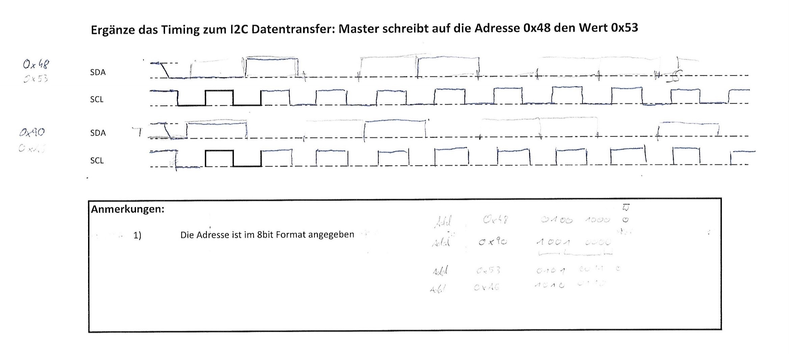
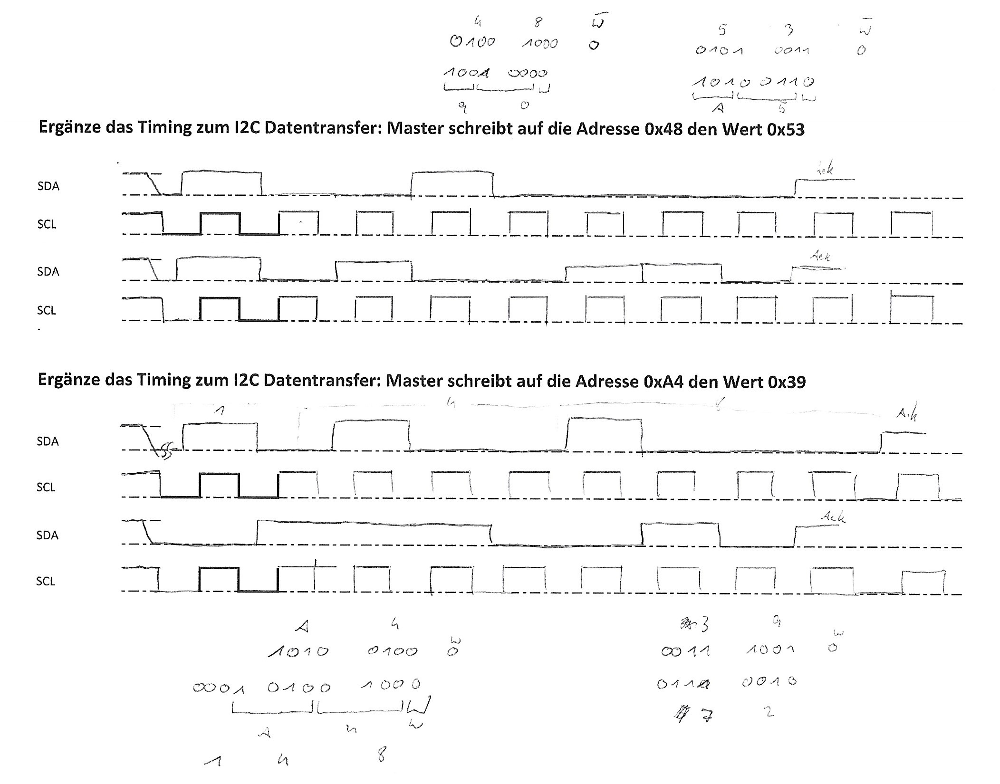

# I²C

## Eigenschaften

* sehr genauer Spezifikation
* 2 Leitungen
  * SDA => Serial Data
  * SCL => Serial Clock
* Byte orientiert
* open collector
  * Pull up wdst
* wired-and
  * wenn 1 Leitung auf 0 gesetzt wird, werden alle Anderen auch auf 0 gesetzt
* Adresse + 7bit + R/W(low aktiv)

### Send Data

1. Start
2. Adresse
3. Acknowledge
4. Data
5. Acknowledge
6. Stop

## Timing Diagramm

