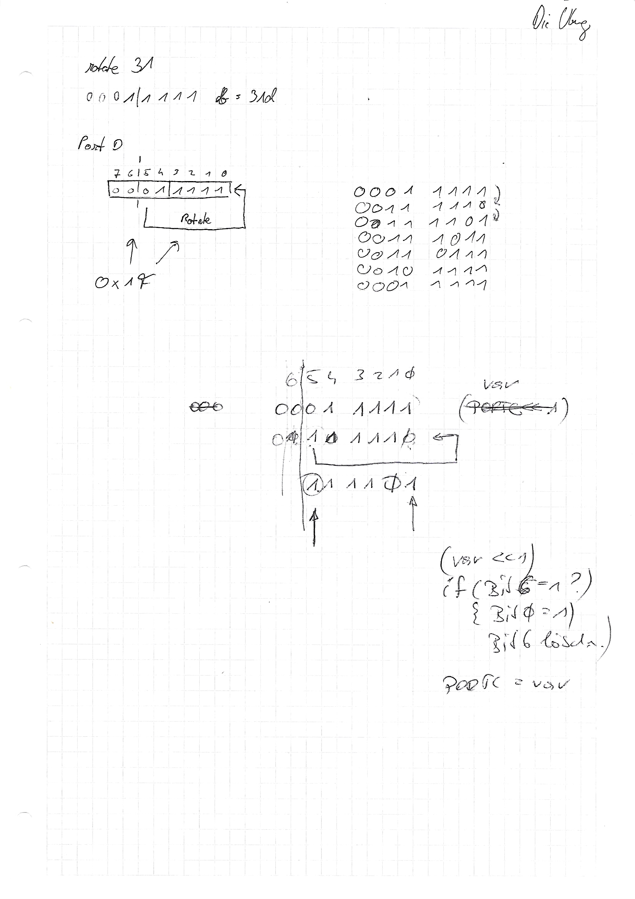

# Rotate 31

```c
#define F_CPU 16000000
#include <avr/io.h>
#include <avr/interrupt.h>
#include <util/delay.h>

void initINT0(){
  //The falling edge of INTn generates asynchronously an interrupt request
	EICRA |= (1<<ISC01);
	//EICRA &= ~(1<<ISC00);
  // Interrupt 0 enable
	EIMSK |= (1<<INT0);
  // set Int Falg
	EIFR |= (1<<INTF0);
}

ISR(INT0_vect){
	EIMSK &= ~(1<<INT0);	
	PORTB = (PORTB << 1);
	if (PORTB >= 64 ){
		PORTB &= 0x3F;
		PORTB |= 0x01;
	}
	_delay_ms(500);
	EIMSK |= (1<<INT0);
	EIFR |= (1<<INTF0);
}


 int main(void){
	 DDRB = 0xFF;
	 PORTB = 0x01;		 
	 sei();
	 initINT0();	 
	 while (1){}
 }
```




### Code mit CTC

```c
#define F_CPU 16000000
#include <avr/io.h>
#include <avr/interrupt.h>

void config(){
	sei();
	OCR0A = 0x1F; //31d
	TCCR0A |= 1 << WGM01;
	TCCR0B |= 1 << CS02;
	TIMSK0 |= (1 << TOIE0) | (1 << OCIE0A);
	TIFR0 |= 1 << OCF0A;
}

ISR(TIMER0_COMPA_vect){
	PORTC++;
	if (PORTC >= 0x80){
		PORTC = 0x00;
	}
}

int main(void){	
	config();
	DDRC = 0xFF;
	PORTC = 0x00;
	while(1){}
}
```

