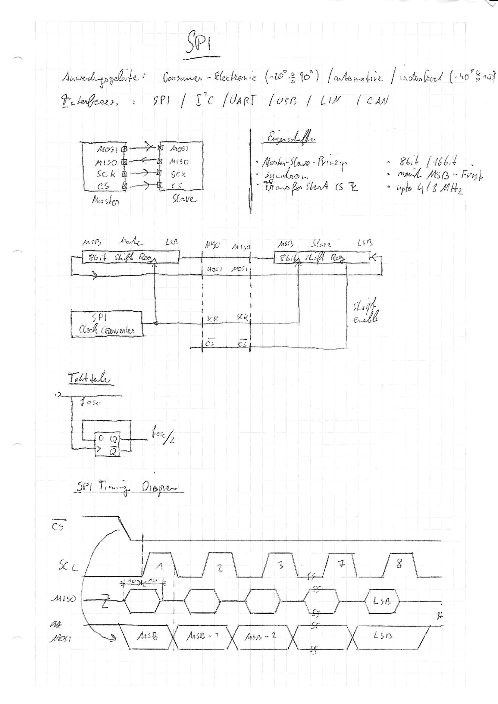
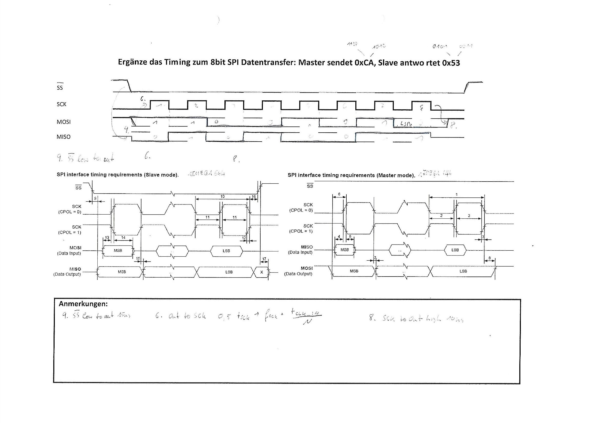
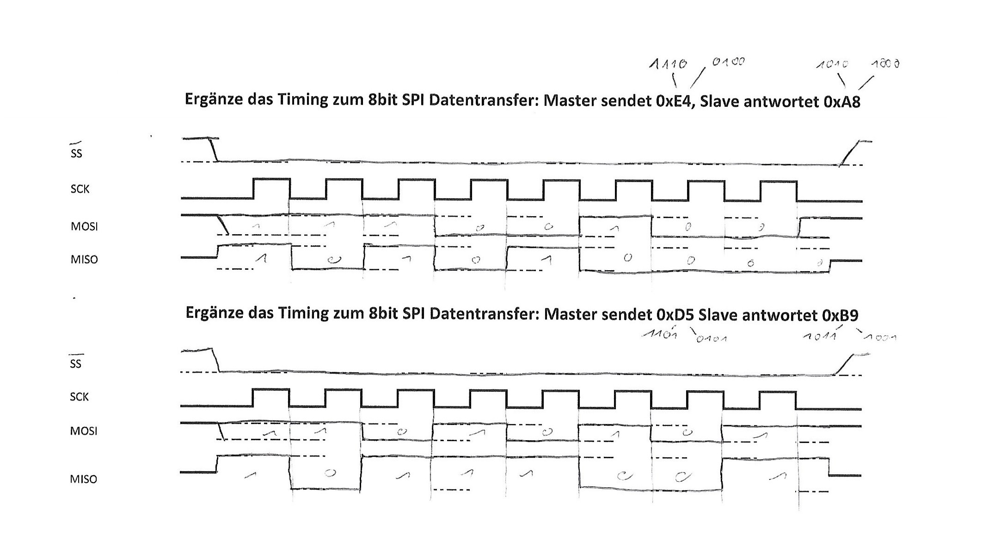

# SPI

## Eigenschaften

* Transferstart wenn CS auf Low gesetzt wird
* synchron
* 8/16 bit
* MSB first
* bis zu 4MHZ (8MHZ double time)
* Master-Slave-Prinzip

### 4 Lanes

* MOSI	=>	Master Out Slave In (SDO)
* MISO        =>        Master In Slave Out (SDI)
* SCK          =>         Serial Clock
* CS            =>         Chip Select

### Pins am ATMEGA

* PB4 => CS (low aktiv)
* PB5 => MOSI
* PB6 => MISO
* PB7 => SCK




## Code

```c
#define F_CPU 16000000
#include <avr/io.h>
#include <util/delay.h>

void initSPI(){
  //SCK, MOSI,CS, SCPH auf 0xFF bevor SPI Settings
	DDRB|= (1<<4) | (1<<5) | (1<<7);
	SPCR |= (1<<SPE) | (1<<MSTR); //4MHZ SPI takt
}

void SPI_send(unsigned int x){
  //sendet alle Werte vom MOSI raus zum Baustein
	SPDR = x;
  //Wenn der serielle Transfer fertig ist wird die SPI Flag gesetzt/
	while(!(SPSR&(1<<SPIF)));
}

int main(void){
	initSPI();
  while (1){
  	PORTB &= ~(1<<4);	//stcp=0
    SPI_send(0xAA);
    PORTB|= (1<<4);		//stcp=1
    //Ausgabe ist das erste Bitmuster
    _delay_us(1);
      
    PORTB &= ~(1<<4); //stcp=0
    SPI_send(0x55);
    //Ausgabe des zweiten Bitmusters
    PORTB|= (1<<4);		//stcp=1
    _delay_us(1);
  }
}
```


## Timing Diagramm




